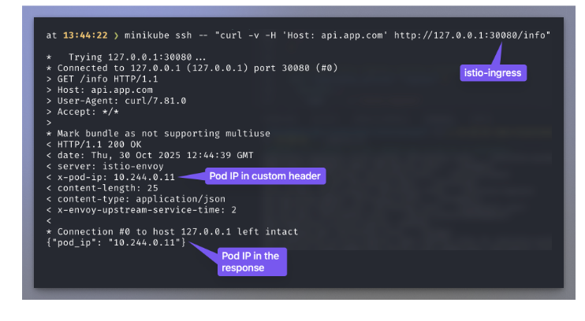

Overview
- Our goal with this stage is to understand your technical skills and your expertise with the technologies below.
- This stage consists of two parts:
	- The first is to complete this technical challenge
	- The second is to meet with the team to discuss your approach and solution in-depth
- Please spend no more than 3-4 hours maximum on this assignment.
- Please send your final solution within 4 business days to the recruitment team. Instructions on the format and what should be included are highlighted in the “Next Steps” section below.
- You are welcome to use AI to help you complete this assignment, but please be prepared to answer questions and explain your technical decisions and the trade-offs you considered throughout the process.

Target Architecture
![[Pasted image 20251030163250.png]]

Technologies to use
- Terraform or cdktf (preferably in TypeScript)
- Moto (in Proxy mode) to simulate AWS responses
- Minikube to set up a local Kubernetes cluster
- Helm to provision the services within Kubernetes

What we expect to see in the project
- Terraform/cdktf code that creates all the necessary components to reach the desired architecture.
- **Istio** and **App** are **Helm-packaged** and **installed using Terraform**. You can use Helm Charts from thecommunity.
- Requests to App are routed exclusively through Istio as App is not exposed outside of the
cluster.
- `Istio Ingress` is published on TCP port 30080.
- Requests are routed to App only if they include the HTTP Host header api.app.com.
- App is a **simple web server of your choice** that **responds to GET /info** requests by returning the Pod’s IP address in both the response body and a custom response header. See the screenshot below for more details

- An idempotent bash script named deploy.sh that provisions the entire solution locally end-to-end.
- A README.md file explaining how to initialize the project and any other information you consider relevant. 

Next steps

*censored*